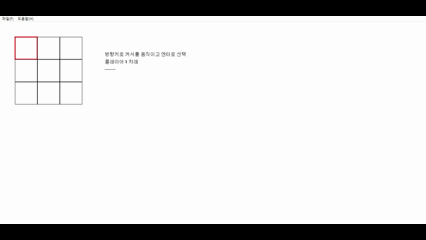

# Tic-tac-toe

### 🎮 Second Toy Project

---

## 📌 Project Overview
- **Game Genre**: Mini Game
- **Development Period**: 2025-09-17 ~ 2025-09-21
- **Team Size**: Solo Development
- **Goal**: To gain a deeper understanding of Windows Programming concepts learned during university lectures

---

## 🔑 Key Technologies
- **C++**
  - Core programming language used for the project

- **Windows Programming**
  - Implemented game logic using the Windows API
  - Managed window events and message handling
  - Rendered graphical elements directly through Windows programming techniques

- **Graphics Rendering**
  - Implemented board rendering and UI drawing
  - Learned how graphical components are displayed and updated in a Windows environment

---

## 🤔 What I Learned
- Since this was my first experience with Windows Programming, I went through many trials and errors during development.

- I learned that Windows Programming works quite differently from standard console or game development environments.

- Although concepts such as handles and graphical rendering were unfamiliar at first, developing Tic-tac-toe helped me better understand how Windows applications process input and render graphics.

---

## 📄 Project Resources

[Tistory Blog Post ](https://fridayfreebie.tistory.com/category/%ED%94%84%EB%A1%9C%EC%A0%9D%ED%8A%B8/Tic-tac-toe%20%28Windows%20Programming%29)

---
